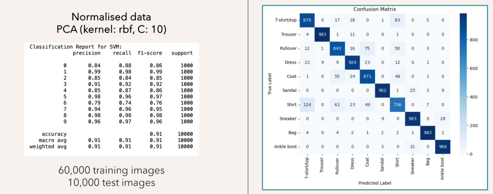

# [Machine Learning] 2nd Proeject

    <b>MSc in Data Science</b>  
    NCSR Demokritos and University of Peloponnese  
    <b>Project for Machine Learning Course</b>  
    Jenuary 2024   
    Myrsini Karakasoglou, Antigoni Moira, Dimitris Tselentis

The objective of this project was to design, implement, tune, and evaluate various Machine Learning models using the <b>Fashion-MNIST Dataset <a href="#footnote1">1</a></b>. Fashion-MNIST consists of 60,000 training and 10,000 test grayscale images (28×28 pixels), each labeled with one of 10 fashion categories (e.g., T-shirt/top, Trouser, Bag).

The project explores the performance of five algorithms: **Naïve Bayes, Logistic Regression, Decision Tree, k-Nearest Neighbors (kNN),** and **Support Vector Machine (SVM)**.

Multiple preprocessing methods were applied:

- **Baseline data (raw pixel values)**

- **Normalized data**

- **Binarized data**

- **Normalized selected data (subset of features)**

- **Binarized selected data**

- **Normalized PCA data**

- **Binarized PCA data**

### 🔍 Pixel-Label Correlation Map

To better understand which parts of the image contribute most to classification, we computed the **absolute correlation between each pixel and the target label**. Red areas indicate pixels with higher correlation to specific classes.

Evaluation was conducted using **5-fold cross-validation**, with **accuracy** as the primary metric.

## 🧪 Results

Below is a summary of the best average validation accuracy (from 5-fold cross-validation) achieved by each model across various preprocessing techniques:

| Model             | Best Preprocessing        | Accuracy (%) | Notes                                           |
|------------------|---------------------------|--------------|-------------------------------------------------|
| Naïve Bayes      | Normalized PCA data         | 74.7         | Performs well on normalized, reduced-dimensional data. |
| Logistic Regression | Binarized PCA data | 85.6         | PCA reduced noise and binarization helped highlight key patterns. |
| Decision Tree    | Binarized data              | 80.8         | No preprocessing helped much. |
| kNN              | Binarized PCA data            | 86.9         | Sensitive to scaling; binarization improved performance. |
| SVM              | Normalized PCA data        | 89.2         | Best overall; dimensionality reduction helped with training time. |

### 📈 Accuracy Comparison by Preprocessing

### 📊 Observations

- **SVM** consistently outperformed other models, especially when used with normalized PCA-transformed data.
- Feature selection and dimensionality reduction (PCA) had a significant impact on both performance and training efficiency.

### 🎯 Tuned SVM Performance

After hyperparameter tuning using grid search (on `C` and `gamma`), the SVM model achieved a **validation accuracy of 90.5%** using normalized PCA-transformed data.

### 📌 Notes
- All models were built using **Scikit-learn**.
- Visualizations were created using **Matplotlib** and **Seaborn**.
- Full implementation details and plots are available in the [`101525_FASHION-MNIST.ipynb`](101525_FASHION-MNIST.ipynb) notebook.

---

  1
  <a href="https://www.kaggle.com/datasets/zalando-research/fashionmnist" target="_blank">Fashion MNIST Database</a>

